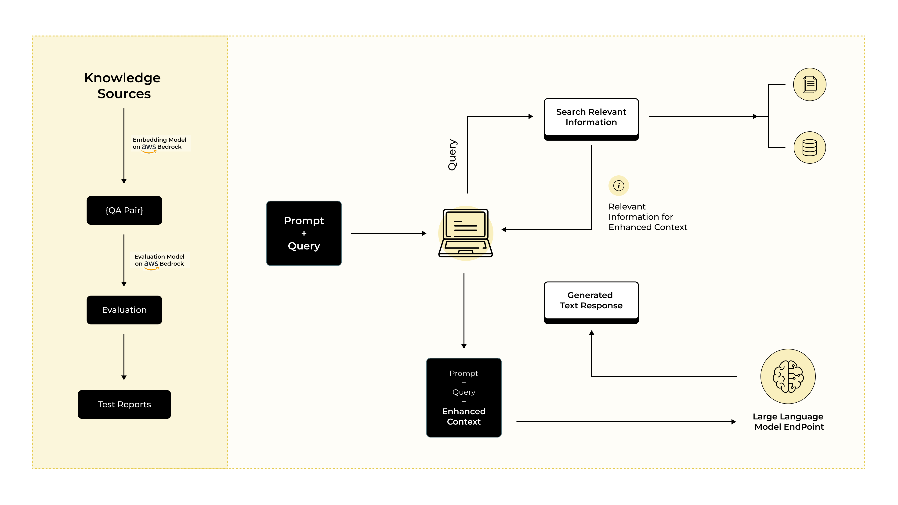

# RAG Evaluation Framework

## Author
**Anand Ramkumar**  
- LinkedIn: [Anand Ramkumar](https://www.linkedin.com/in/anand-ramkumar-04675a1b2)  
- Role: Test Architect at [Experion Technologies](https://experionglobal.com/)  
- Experienced Test Architect specializing in AI-driven testing, automation frameworks, and data validation, ensuring high-quality, scalable software solutions.

---

A comprehensive framework for evaluating Retrieval Augmented Generation (RAG) systems using AWS Bedrock and DeepEval metrics. This framework provides tools for measuring and improving RAG system performance through synthetic test case generation and detailed evaluation.

**Note:**  
The RAG application provided in this repository is a demo implementation. It is intended for demonstration and educational purposes, to showcase how RAG evaluation can be conducted using this framework.

## Key Notebooks
- `golden_generator.ipynb`: Generate QA pairs (LLM test cases) for evaluation.
- `rag_eval_analysis.ipynb`: Step-by-step walkthrough of the evaluation process using a sample test case.

## Getting Started

You can use this framework in two ways: through interactive Jupyter notebooks (recommended for beginners), or by running the evaluation pipeline directly via the command line (for advanced users).

### 1. Beginner Flow: Using the Notebooks
This flow is ideal for new users who want to understand the framework step-by-step in an interactive environment.

> **Note:** By default, DeepEval uses OpenAI's `gpt-4o` for generating goldens and `text-embedding-3-small` as the embedding model.

- **Step 1:** Open `golden_generator.ipynb`  
  Generate LLM test cases (also referred to as “QA pairs” or “goldens”) using DeepEval and save them to `synthetic_data/goldens.json`.

- **Step 2:** Open `rag_eval_analysis.ipynb`  
  Load the generated test cases, configure the evaluation, run the process cell by cell, and view detailed results and Excel reports.

### 2. Advanced/Script Flow: Using the Source Code
Once you’re comfortable with the framework, you can run the full evaluation pipeline via the command line for automation or integration.

- **Step 1:** Ensure you have generated test cases in `synthetic_data/goldens.json` (via the notebook above).
- **Step 2:** From the project root, run:
  ```bash
  python -m src.run_evaluation
  ```
  This will initialize the demo RAG application, load the pre-generated test cases (LLM test cases/QA pairs/goldens), perform evaluation, and save the resulting reports.

**Note:** The LLM test cases must be generated in advance by running the `golden_generator.ipynb` notebook. For creating the goldens (QA pairs), the DeepEval recommended/default embedding LLM (OpenAI) is used.


## System Architecture

### RAG Evaluation Flow


## Prerequisites

### AWS Setup
1. Install AWS CLI
   ```bash
   # Windows (using MSI installer)
   # Download from: https://awscli.amazonaws.com/AWSCLIV2.msi
   # Run the downloaded MSI installer

   # After downloading your AWS access keys (credentials.json)
   aws configure
   # Enter your:
   # - AWS Access Key ID
   # - AWS Secret Access Key
   # - Default region (ap-south-1)
   # - Default output format (json)
   ```

### AWS Bedrock Setup
1. Enable AWS Bedrock service in your AWS account
2. Request access to required models (LLaMA3-70B)
3. Create a Knowledge Base for RAG context storage
4. Note your Knowledge Base ID for configuration

### Environment Setup
1. Create Conda Environment
   ```bash
   # Create new environment
   conda create -n aws-bedrock python=3.9
   conda activate aws-bedrock
   ```

2. Install Dependencies
   ```bash
   pip install -r requirements.txt
   ```

   Key packages include:
   - boto3 (AWS SDK)
   - deepeval (Evaluation metrics)
   - pandas (Data handling)
   - jupyter (Notebook interface)
   
3. Configure Environment Variables
   ```bash
   # Copy example env file
   cp .env.example .env
   ```
   
   Required configurations in `.env`:
   - OpenAI API key for synthetic test generation
   - AWS Bedrock region and model configurations
   - Knowledge Base ID for context retrieval
   - Evaluator model configurations

   See [.env.example](cci:7://file:///d:/RAGeval-Workspace/rageval/.env.example:0:0-0:0) for all required variables.

## Project Structure
1. Notebooks
   - `golden_generator.ipynb`: Creates synthetic test cases using DeepEval
   - `rag_eval_analysis.ipynb`: Demonstrates evaluation workflow with sample test case

2. Source Code (`src/`)
   - `config/`: AWS Bedrock and evaluation configurations
   - `data/`: Data loading and processing utilities
   - `rag/`: RAG system integration with AWS Knowledge Base
   - `evaluation/`: Test case generation and GEval metrics
   - `reporting/`: Excel report generation with detailed analysis

## Quick Start
1. Generate Test Cases
   - Open `golden_generator.ipynb`
   - Configure DeepEval Synthesizer
   - Generate and save test cases to `goldens.json`

2. Run Evaluation
   - Open `rag_eval_analysis.ipynb`
   - Load test cases and configure GEval metric
   - Execute evaluation and view results
   - Generate detailed Excel reports

## Features
- Production-grade RAG evaluation pipeline
- AWS Bedrock integration
- DeepEval's GEval metric implementation
- Expandable architecture for additional metrics
- Comprehensive Excel reporting
- AWS-native evaluation solution

## Evaluation Framework
This project uses DeepEval, one of several available RAG evaluation packages. Other alternatives include RAGAS, Giskard, and custom evaluation frameworks.

### Current Implementation
- Uses DeepEval's GEval metric
- Evaluates responses on multiple dimensions:
  - Factual Accuracy
  - Answer Completeness
  - Response Clarity

### Key Components
- Synthesizer: Generates synthetic test cases
- LLMTestCase: Standardized test case format
- Evaluation Parameters: 
  - Input query
  - Actual RAG output
  - Expected answer
  - Retrieved context

### Extensibility
- Support for additional DeepEval metrics
- Capability to integrate other evaluation frameworks
- Customizable evaluation criteria
- Configurable scoring thresholds

## Documentation
- [DeepEval GEval Documentation](https://www.deepeval.com/docs/metrics-llm-evals)
- [Research Paper](https://arxiv.org/abs/2303.16634)
